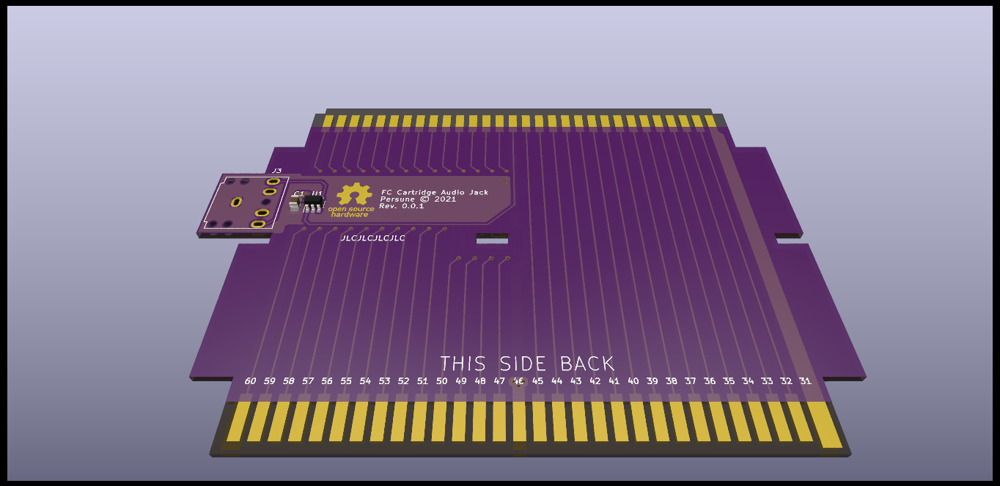

# FC Cartridge Audio Jack

An audio jack output for unmodified RF Famicom systems.

## Instructions for installation

Upcoming!

## PCB Specifications

Note that this project is optimized for JLCPCB manufacturing, so you may have to modify the gerber export, remove the "JLCJLCJLCJLC" silkscreen text, etc.

- 2 layers
- 97.0mm x 64.3mm
- 1.2mm thickness
- ENIG-RoHS surface finish recommended; Gold fingers optional
- dark silkscreen, light soldermask

## License

The PCB and schematics are licensed under the [TAPR Open Hardware License](https://tapr.org/the-tapr-open-hardware-license/). © Persune 2022

## Credits

- [@N-SPC700](https://github.com/N-SPC700) for suggesting this idea
- [@Lockster-Inc](https://github.com/Lockster-Inc) for the wonderful silkscreen art
- lidnariq, Finny: advice for terminating audio output
- Finny: buffer circuit design, based on reverse engineered RF modulator schematics
- Special thanks to the NESDEV community, this project wouldn't have been possible without their extensive help and wiki.

## Support

If you enjoy this project or find it helpful, please support me on [Ko-Fi](https://ko-fi.com/persune) or [Patreon](https://www.patreon.com/persune)!
