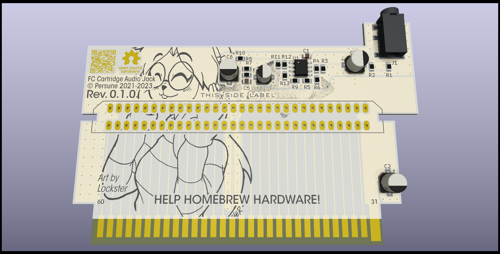

# FC Cartridge Audio Jack

An audio jack output for unmodified RF Famicom systems.

## Instructions for installation

Upcoming!

## PCB Specifications

Note that this project is optimized for JLCPCB manufacturing, so you may have to modify the gerber export, remove the "JLCJLCJLCJLC" silkscreen text, etc.

- 2 layers
- 91.28mm x 58.34mm
- 1.2mm thickness
- ENIG-RoHS surface finish recommended; Gold fingers optional
- Light silkscreen, dark soldermask

## License

The PCB and schematics are licensed under the TAPR Open Hardware License ([www.tapr.org/OHL](http://www.tapr.org/OHL)). © Persune 2021

## Credits

- [@N-SPC700](https://github.com/N-SPC700) for suggesting this idea
- Special thanks to the NESDEV community, this project wouldn't have been possible without their extensive help and wiki.

## Support

Support me on [Ko-Fi](https://ko-fi.com/persune) to help me afford hardware development equipment and further improve this project!
